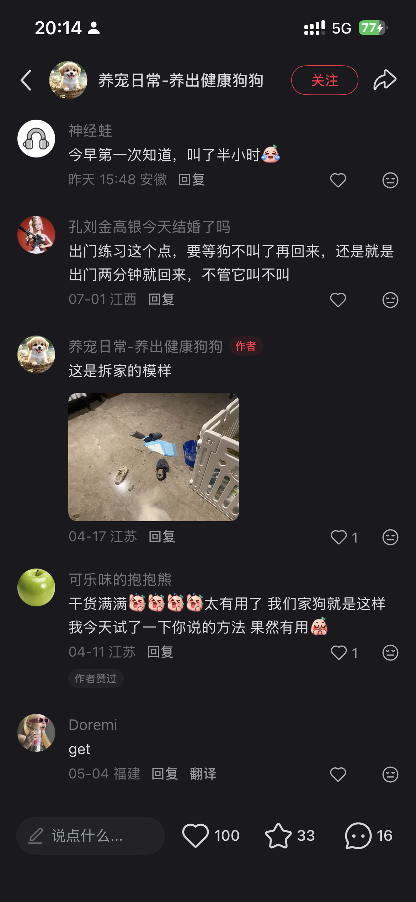
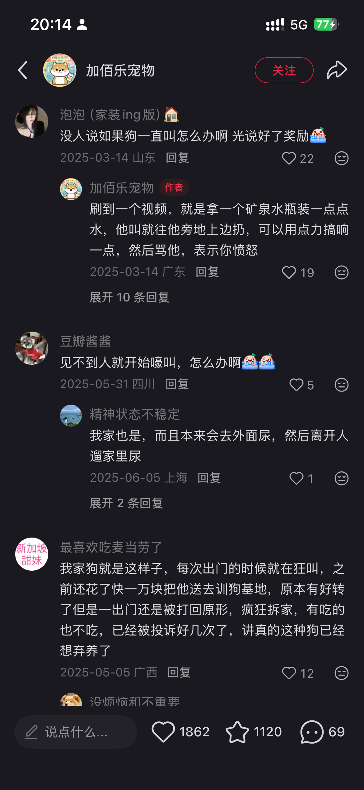

# 陪训 PetCoach · AI 宠物行为训练教练

> **免费教程铺天盖地，但很多新手养狗人坚持不到训练见效。我们的赌注是：用 AI 陪跑把“数周后才有感”改造成“每天都有反馈”，填上这道“放弃鸿沟”。**
> 本 Demo 已跑通「输入描述 → 行为诊断 → 严重度分级 → 个性化训练计划」主线，并演示了本地打卡进度与规则化次日提示；真正要验证的是：AI 陪跑能不能让用户持续执行到看见改善。

---

### ① 机会判断

- **目标用户**：城市 90/00 后新手养狗人（狗 0–3 岁），被拆家、分离焦虑、乱尿、乱叫击穿。最新白皮书报道显示，90 后占宠主 **42.7%**、00 后 **26.3%**。
- **核心痛点**：缺的不是方法，是**坚持与反馈**。用户可能很快放弃，但训练见效往往要**数周至数月**；线下训练动辄几千元，且“回家后能不能继续执行”仍取决于主人；免费视频不个性化、无反馈。
- **为什么现在**：① 2025 年城镇犬猫消费规模 **3126 亿元**，服务占比仅 **6.5%**（医疗 27.6%），渗透率仍低；② 付费主力换成习惯 App/AI 的 90/00 后；③ 多模态 LLM 正成熟到能“看视频给即时反馈”，这是下一步护城河（当前 Demo 先用文本模型跑通主线）；④ 线下训练行业信任受损，透明正向强化成为卖点。
- **主动亮风险**：打卡/习惯类 App 本身留存也差。用户对免费视频坚持不了，凭什么对我的 App 坚持数周？**“AI 能否真正提升坚持率”是本方向命门，也是 2 周计划要验证的核心假设。**

### ② 用户证据（可核查链接）

- **痛点高频**：知乎分离焦虑讨论里反复出现“嚎叫、刨门、破坏、独处焦虑”等求助（[知乎问答](https://www.zhihu.com/question/346277367)、[知乎专栏](https://zhuanlan.zhihu.com/p/72871048)）；可读备用来源也将分离焦虑症状列为吠叫/嚎叫、啃咬家具或抓门、踱步等（[Farmina](https://www.farmina.com/cn/pet-care/geniustips/2241/%E5%BA%94%E5%AF%B9%E7%8B%97%E7%8B%97%E5%88%86%E7%A6%BB%E7%84%A6%E8%99%91.html)）。
- **已成熟付费市场**：羊城晚报报道到府课可到 **¥1000–3000/节**（[腾讯转载](https://news.qq.com/rain/a/20220718A01UBZ00)）；CBNData/市值榜报道基础服从训练普遍高于 **¥3000**、有机构收费 **¥5800/月**（[CBNData](https://www.cbndata.com/information/248464)）；央视网报道宠物学校课程 **1–2 个月 ¥3500–4500**，线下宠物训练从几千到上万元不等（[央视网](https://news.cctv.com/2022/06/25/ARTIpyMIKLR6v6BoqUbMdei2220625.shtml)）。
- **现有方案吐槽**：央视网报道李雪琴自曝“花 5000 送狗上学，1 个月啥也没学会”，同时提到行业证书混乱和训练方式争议（[央视网](https://news.cctv.com/2022/06/25/ARTIpyMIKLR6v6BoqUbMdei2220625.shtml)）。
- **市场盘**：央视网报道《2026 年中国宠物行业白皮书》重点数据：2025 年城镇犬猫消费市场 **3126 亿元**，单只犬年均消费 **3006 元**，食品/医疗/用品/服务占比分别为 53.7%/27.6%/12.2%/**6.5%**（[央视网](https://business.cctv.com/2026/01/05/ARTIdmv2AWmVeRVodaZYLOvQ260105.shtml)）。
- **小红书/淘宝真实评论（社群观察）**：小红书用户“出门练习这个点，要等狗不叫了再回来，还是就是出门两分钟就回来，不管它叫不叫”；淘宝训犬课买家“之前还花了快一万块把他送去训狗基地，原本有好转了但是一出门还是被打回原形，疯狂拆家，有吃的也不吃，已经被投诉好几次了，讲真的这种狗已经想弃养了”。（截图见仓库 evidence/ 目录）
   
- **证据强度自陈**：以上全部来自公开网络资料/桌面调研，**我尚未做过任何一手访谈或问卷**。“3–7 天放弃”是我从求助帖归纳的待验证假设，不是实测数据——这正是下一步（见 ⑤）计划去校准的第一个问题。

### ③ MVP 样例（可运行 Demo）

Next.js + 三段式 AI 工作流：**Stage1** 把口语描述结构化 → **Stage2** 行为根因诊断 + 医疗边界 + 严重度分级 → **Stage3** 生成 4–8 周训练计划（每周目标 + 每日任务 + 成功标准 + 所需道具 + 安全红线）。

- **已完成**：文本模型主线、mock/live 双模式、结构校验兜底、诊断卡、6 周计划、打卡进度、本地 localStorage 记住打卡、基于完成率的规则化次日提示。
- **下一步**：把打卡反馈真正回传给 AI 微调次日任务；接入短视频/图片理解，判断动作是否正确、狗的压力信号是否升高；做账号/数据库/支付。
- **诚实边界**：当前 Demo 的“次日提示”是前端规则演示，不是已完成的 AI 视频反馈闭环；当前 DeepSeek 文本模型不读取图片/视频。

  
  

### ④ 商业判断

- **谁付费**：愿为狗花钱（2025 年单只犬年均消费 ¥3006）、习惯线上服务、被线下“贵且不确定”劝退的新手养狗人。
- **为什么付费**：买的不是知识（免费遍地），而是“坚持执行 + 持续反馈”。¥99 六周训练营相对线下 ¥1000+ 足够低，且训练中可推荐围栏/漏食球/零食做 CPS。
- **诚实标注**：付费意愿目前只有间接证据（线下市场），针对本产品的真实付费信号要用假付费按钮和 waitlist 转化实测；before-after 传播依赖真实效果，不能在验证前当作已成立。

### ⑤ 2 周验证计划（假设 + 资源 + go/no-go）

- **Week 1 · 需求验证（尚未开始，以下为计划）**：去深访 **10 位**新手狗主（小红书私信/社群/问卷星），校准“放弃时点”和付费意愿；上线 Landing Page，投 ¥200–500 测“点击→留资”。
  - **成功阈值**：留资率 ≥ 10%；≥ 6/10 受访者能说出明确放弃时点或卡住原因。
- **Week 2 · 产品验证**：邀 **10 人真实试用 14 天**（窗口从 7 天改为 14 天），核心指标 = **D7/D14 留存 + 每日打卡完成率 + 连续 3 天完成占比 + 假付费点击转化**。
  - **go / no-go 阈值**：D14 留存 ≥ 40% 且连续 3 天打卡完成率 ≥ 50% 且假付费点击转化 ≥ 15% → 继续；否则回炉重想陪跑机制。
  - **样本说明**：n=10 只取定性信号与方向，不做统计结论。
- **资源投入**：个人时间（4–6h/天）、AI API（约 ¥数百）、Vercel（免费）、¥200–500 投放、剪辑/问卷工具。**无需大预算**。

---

🔗 **在线 Demo**：[https://pet-coach-mvp.vercel.app/](https://pet-coach-mvp.vercel.app/) ｜ **代码仓库**：[github.com/bbainthug/pet-coach-mvp](https://github.com/bbainthug/pet-coach-mvp)  　⚠️ 本产品定位行为训练辅助，不替代兽医诊疗。
