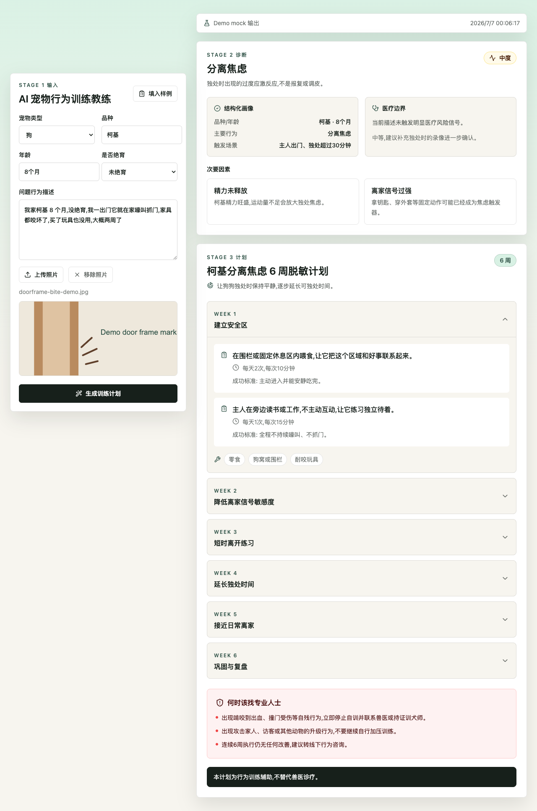
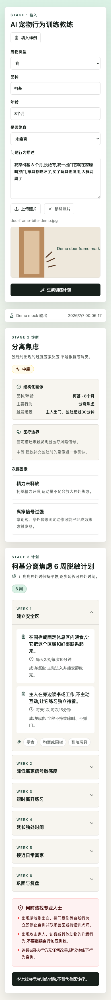

# AI 宠物行为训练教练 · MVP

用 AI 把新手养宠人的口语描述转成行为诊断、训练计划和可执行的每日任务，先跑通“诊断 → 分级 → 计划 → 本地打卡”的陪跑主线。

**在线 Demo**：[https://pet-coach-mvp.vercel.app/](https://pet-coach-mvp.vercel.app/)

## Screenshots





## What It Does

用户输入宠物类型、品种、年龄、绝育状态、问题行为描述，并可上传一张照片预览。应用会通过三段式工作流输出：

- Stage 1：结构化宠物画像与问题行为
- Stage 2：行为根因诊断、严重度分级、医疗边界
- Stage 3：4–8 周训练计划、每日任务、成功标准、所需道具、安全红线

当前 Demo 还包含本地打卡进度、`localStorage` 持久化和基于完成率的规则化次日提示。它是陪跑闭环的最小演示，不是完整的 AI 视频反馈系统。

## Local Setup

```bash
npm install
cp .env.local.example .env.local
npm run dev
```

然后打开 `http://localhost:3000`，点击「填入样例」→「生成训练计划」。

## Mock vs Live

模式由环境变量决定：

| `DEEPSEEK_USE_MOCK` | `DEEPSEEK_API_KEY` | 实际模式 |
|---|---|---|
| `true` | 任意 | mock |
| `false` | 任意 | live |
| 空 | 已填 | live |
| 空 | 空 | mock |

- **mock**：返回 `lib/sample.ts` 的确定性样例，适合本地预览和稳定演示。
- **live**：真实调用 DeepSeek 三段式生成，需要在 `.env.local` 临时填写 `DEEPSEEK_API_KEY`。

`.env.local` 已被 `.gitignore` 忽略，不应提交。公开仓库只保留 `.env.local.example`。

## Environment Variables

```bash
DEEPSEEK_API_KEY=
DEEPSEEK_BASE_URL=https://api.deepseek.com
DEEPSEEK_MODEL=deepseek-chat
DEEPSEEK_USE_MOCK=
DEEPSEEK_SEND_IMAGE=false
```

当前默认 `DEEPSEEK_SEND_IMAGE=false`：`deepseek-chat` 不具备图片理解能力，图片只做前端预览，不发送给模型。后续切换视觉模型时再开启。

## Completed

- Next.js App Router + TypeScript + Tailwind CSS 单页 Demo
- `/api/coach` 串行编排 Stage1 → Stage2 → Stage3
- DeepSeek live / deterministic mock 双模式
- Zod 输入校验与 live 输出结构兜底
- 结果页：诊断卡、严重度刻度、训练计划、红线、免责声明
- 本地打卡进度、`localStorage` 持久化、规则化次日提示
- Vitest + Testing Library 测试覆盖核心逻辑和组件交互

## Next Steps

- 把打卡反馈回传给 AI，真正生成次日任务微调
- 接入视觉/短视频模型，判断训练动作和宠物压力信号
- 增加账号、数据库、真实进度追踪和支付
- 用 10 位真实用户做 14 天试用，验证 D7/D14 留存和打卡完成率

## Project Structure

```text
app/
  page.tsx
  api/coach/route.ts
components/
  IntakeForm.tsx
  DiagnosisCard.tsx
  TrainingPlan.tsx
  RedLineAlert.tsx
lib/
  coach.ts
  llm.ts
  prompts.ts
  schemas.ts
  sample.ts
tests/
```

## Verification

```bash
npm test
npm run build
```

## Docs

- [A4 提交正文](./A4-提交正文.md)
- [产品与 AI 工作流规格](./pet-behavior-coach-spec.md)
